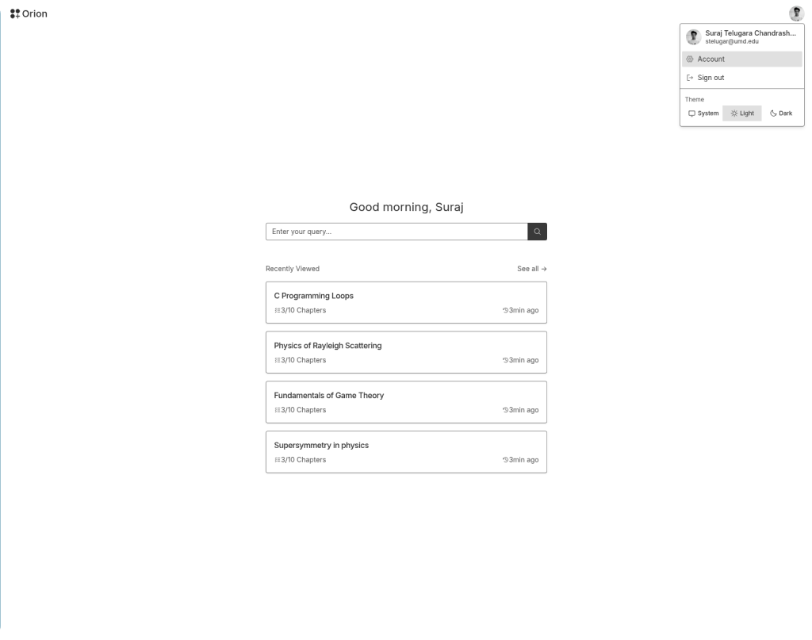
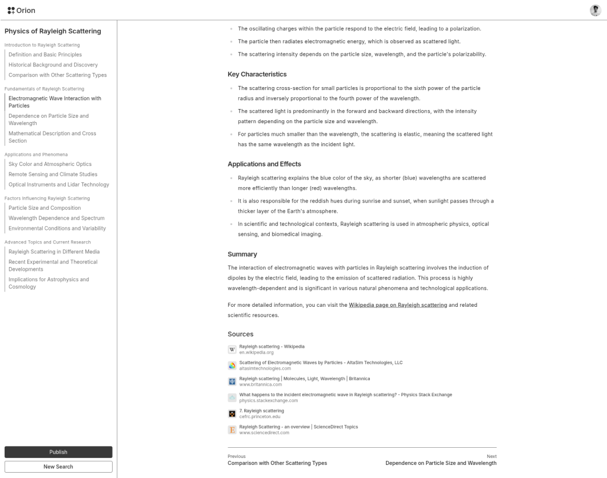

# Orion

A semantic answer engine that generates interactive, markdown-style answer maps using AI. Orion lets users explore connected topics and learn through dynamic, AI-powered paths.


## Features

- **AI-Powered Content Generation**: Creates structured, comprehensive content using OpenAI models
- **Real-time Web Search**: Integrates with Brave Search API for up-to-date information
- **Interactive Answer Maps**: Hierarchical content exploration with nested topics and subtopics
- **Markdown Rendering**: Rich markdown support with syntax highlighting and custom components
- **Secure Authentication**: Google OAuth integration with Better Auth
- **Dark/Light Theme**: Modern UI with theme switching capabilities
- **Responsive Design**: Mobile-first design with Tailwind CSS
- **Real-time Updates**: Live content generation with streaming responses
- **Persistent Storage**: SQLite database with Drizzle ORM for data persistence

## Screenshots




## Tech Stack

Next.js, Tailwind CSS, Shadcn/ui, Vercel AI SDK, OpenAI, SQLite, Drizzle ORM
## Project Structure

```
web/
├── app/          # Next.js app router
├── components/   # React components & UI elements
├── lib/          # Database, AI logic, and utilities
├── hooks/        # Custom React hooks
└── public/       # Static assets
```

## Requirements

Node.js 18+, pnpm

## Installation

```bash
cd web
pnpm install
pnpm db:generate && pnpm db:migrate
pnpm dev
```

Create `.env.local` with your API keys:
```env
OPENAI_API_KEY=your_key
BRAVE_API_KEY=your_key  
GOOGLE_CLIENT_ID=your_id
GOOGLE_CLIENT_SECRET=your_secret
BETTER_AUTH_SECRET=your_secret
```

## Scripts

```bash
pnpm dev         # Development server
pnpm build       # Production build
pnpm lint        # Lint code
pnpm db:generate # Generate migrations
pnpm db:migrate  # Run migrations
```

## API

- `POST /api/gen/root` - Generate content map
- `POST /api/gen/node` - Generate node
- `GET /api/nodes/[...path]` - Get nodes
- `POST /api/nodes` - Create node

## License

This project is licensed under the MIT License - see the [LICENSE](LICENSE) file for details.